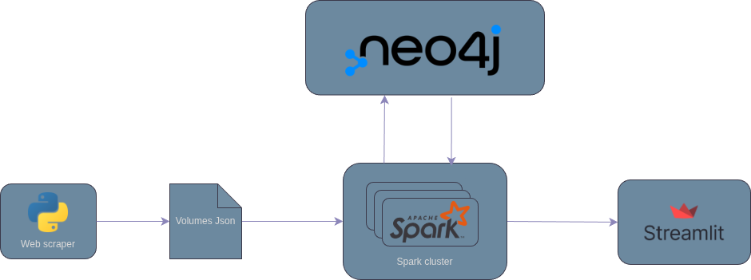

# 📚 Research Paper Network Explorer
A comprehensive system for scraping, analyzing, and visualizing research paper networks from CEUR Workshop Proceedings. This project combines web scraping, graph database technology, distributed computing, and interactive visualization to explore relationships between academic papers, authors, keywords, and volumes.

# 🎯 Project Overview
The Research Paper Network Explorer is designed to extract, process, and analyze academic research data from [CEUR-WS](www.CEUR-WS.org), a free open-access publication service for workshop and conference proceedings. The system creates a knowledge graph that reveals hidden patterns in academic collaboration, research trends, and paper relationships.



## Key Features
- **Automated Web Scraping**: Extracts paper metadata, abstracts, and keywords from PDF documents
- **Graph Database Storage**: Utilizes Neo4j to model complex relationships between papers, authors, volumes, and keywords
- **Distributed Processing**: Leverages Apache Spark for scalable data injection and analysis
- **Interactive Visualization**: Provides a Streamlit-based web interface for exploring the network
- **Advanced Analytics**: Includes community detection, link prediction, and similarity analysis algorithms

## 🛠️ Technologies
**Neo4j (Graph Database)**  
Neo4j is a native graph database that stores data as nodes and relationships rather than tables. It's ideal for this project because academic data is inherently graph-structured - papers are written by authors, belong to volumes, and share keywords. Neo4j's Cypher query language makes it easy to traverse these complex relationships.

**Apache Spark**  
Apache Spark is a unified analytics engine for large-scale data processing. In this project, Spark:

- Handles parallel data injection into Neo4j
- Executes distributed graph algorithms through the Neo4j Spark Connector
- Processes large volumes of papers efficiently

**Docker & Docker Compose**  
Docker ensures consistent environments across different systems by containerizing each component. Docker Compose orchestrates multiple services (Neo4j, Spark, Streamlit) with proper networking and dependencies.

**Streamlit (Web Interface)**
Streamlit is a Python framework for creating data applications. It provides an intuitive interface for users to explore the paper network without needing technical expertise.

## 📊 Data Pipeline
## 1. Web Scraping  
The scraper extracts data in multiple stages:

1. **Volume Discovery:** Fetches all available volume identifiers from CEUR-WS.org
2. **Metadata Extraction:** For each volume, extracts:
   - Volume information (title, year, location, editors)
   - Paper listings with authors and page numbers
3. **PDF Processing:** Downloads and analyzes paper PDFs to extract:
   - Title
   - Abstract
   - Keywords
4. **JSON Storage:** Saves structured data as JSON files for processing

## 2. Data Injection  
The injection module uses PySpark to:  
1. **Read JSON Files**: Loads scraped data with defined schema
2. **Create Graph Structure**: Transforms flat data into graph relationships:  
  - `Person -[AUTHORED]-> Paper`
  - `Person -[EDITED]-> Volume`
  - `Paper -[HAS_KEYWORD]-> Keyword`
  - `Volume -[CONTAINS]-> Paper`
    
3. **Batch Processing**: Efficiently writes nodes and relationships to Neo4j

# 🚀 Functionalities / Core Features

// TODO

# 📦 Installation & Setup
## Requirements

The only prerequisite is a working Docker installation, which includes Docker Compose.

### 1. Check for Docker

Verify your installation by running the following commands in your terminal:

```bash
# Check Docker Engine version
docker --version

# Check Docker Compose version
docker compose version
```

### 2. Install Docker
If Docker is not installed, download and install Docker Desktop from the official website:

[Get Docker](https://www.docker.com/products/docker-desktop/?utm_source=chatgpt.com)

Docker Desktop includes Docker Engine, Docker Compose, and other necessary tools.

## Quickstart
  1. **Clone Repository**
  ```bash
  git clone https://github.com/nicol-buratti/TBDM.git
  ```

 2. **Run the web scraper**
  ```bash
  docker compose --profile scraper up
  ```

 3. **Inject the data into Neo4j**
  ```bash
  docker compose --profile injection up
  ```

 4. **Run the frontend**
  ```bash
  docker compose --profile streamlit up
  ```
Access the application at [http://localhost:8501](http://localhost:8501)

### ⚠️ Known Issues

- **Frontend Interaction**: Any interaction on the frontend currently leads to an error, requiring a Streamlit to reboot.
- **Feature Visualization**: To ensure all features are visible in the app, you must first run the following query in the Neo4j browser:
```cypher
call gds.graph.project("graph",
        ["Keyword", "Paper", "Volume", "Person"],
        {
          HAS_KEYWORD: {orientation: "UNDIRECTED"},
          CONTAINS: {orientation: "UNDIRECTED"},
          AUTHORED: {orientation: "UNDIRECTED"},
          EDITED: {orientation: "UNDIRECTED"}
        }
      )
```

## Service ports
- **Neo4j Browser**: [http://localhost:7474](http://localhost:7474)
- **Spark UI**: [http://localhost:8080](http://localhost:8080)
- **Streamlit App**: [http://localhost:8501](http://localhost:8501)

# Participants

- Nicol Buratti - nicol.buratti@studenti.unicam.it
- Kevin Concettoni - kevin.concettoni@studenti.unicam.it

# 📄 License 
This project is licensed under the Apache 2.0 license - see the LICENSE file for details.
