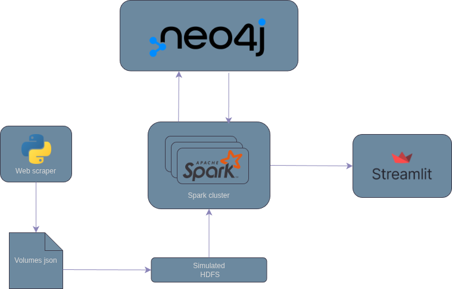

# 📚 Research Paper Network Explorer
A comprehensive system for scraping, analyzing, and visualizing research paper networks from CEUR Workshop Proceedings. This project combines web scraping, graph database technology, distributed computing, and interactive visualization to explore relationships between academic papers, authors, keywords, and volumes.

# 🎯 Project Overview
The Research Paper Network Explorer is designed to extract, process, and analyze academic research data from [CEUR-WS](www.CEUR-WS.org), a free open-access publication service for workshop and conference proceedings. The system creates a knowledge graph that reveals hidden patterns in academic collaboration, research trends, and paper relationships.



## Key Features
- **Automated Web Scraping**: Extracts paper metadata, abstracts, and keywords from PDF documents
- **Graph Database Storage**: Utilizes Neo4j to model complex relationships between papers, authors, volumes, and keywords
- **Distributed Processing**: Leverages Apache Spark for scalable data injection and analysis
- **Interactive Visualization**: Provides a Streamlit-based web interface for exploring the network
- **Advanced Analytics**: Includes community detection, link prediction, and similarity analysis algorithms

## 🛠️ Technologies

# **Neo4j (Graph Database)**  


Neo4j is a leading ACID-compliant graph database management system (DBMS) that stores and queries data as nodes and relationships, providing superior performance for highly connected datasets compared to traditional relational databases. It uses the property graph model and is built on a Java-based NoSQL foundation, making it ideal for use cases like recommendation engines, social networks, and knowledge graphs. 

# **Apache Spark**  


Apache Spark is a unified analytics engine for large-scale data processing. It provides high-level APIs in Java, Scala, Python and R, and an optimized engine that supports general execution graphs. It also supports a rich set of higher-level tools including Spark SQL for SQL and structured data processing, pandas API on Spark for pandas workloads, MLlib for machine learning, GraphX for graph processing, and Structured Streaming for incremental computation and stream processing. 
In this project, Spark:

- Handles parallel data injection into Neo4j
- Executes distributed graph algorithms through the Neo4j Spark Connector
- Processes large volumes of papers efficiently

# **Docker & Docker Compose**  


Docker is an open platform for developing, shipping, and running applications. Docker enables you to separate your applications from your infrastructure so you can deliver software quickly. With Docker, you can manage your infrastructure in the same ways you manage your applications. By taking advantage of Docker's methodologies for shipping, testing, and deploying code, you can significantly reduce the delay between writing code and running it in production.

# **Streamlit (Web Interface)**


Streamlit is an open-source Python framework for data scientists and AI/ML engineers to deliver dynamic data apps with only a few lines of code. Build and deploy powerful data apps in minutes.

## 📊 Data Pipeline
## 1. Web Scraping  
The scraper extracts data in multiple stages:

1. **Volume Discovery:** Fetches all available volume identifiers from CEUR-WS.org
2. **Metadata Extraction:** For each volume, extracts:
   - Volume information (title, year, location, editors)
   - Paper listings with authors and page numbers
3. **PDF Processing:** Downloads and analyzes paper PDFs to extract:
   - Title
   - Abstract
   - Keywords
4. **JSON Storage:** Saves structured data as JSON files for processing

## 2. Data Injection  
The injection module uses PySpark to:  
1. **Read JSON Files**: Loads scraped data with defined schema
2. **Create Graph Structure**: Transforms flat data into graph relationships:  
  - `Person -[AUTHORED]-> Paper`
  - `Person -[EDITED]-> Volume`
  - `Paper -[HAS_KEYWORD]-> Keyword`
  - `Volume -[CONTAINS]-> Paper`
    
3. **Batch Processing**: Efficiently writes nodes and relationships to Neo4j

# 🚀 Functionalities / Core Features

## Community Detection
Identifies clusters of closely related papers, authors, or keywords within the graph.  
- Uses graph-based algorithms (e.g., Louvain or Label Propagation) to detect modular structures.  
- Helps reveal research communities, collaborative groups, and thematic clusters across volumes.  

## Link Prediction
Predicts potential relationships that are not explicitly present in the current graph.  
- Utilizes similarity metrics and graph embeddings to suggest:  
  - Future collaborations between authors  
  - Related papers based on shared keywords or citations  
  - Connections between volumes and emerging topics  

## Similarity Analysis
Quantifies the similarity between nodes in the graph to discover patterns and relationships.  
- Measures similarity between papers, authors, or keywords using graph-based metrics.  
- Supports tasks such as:  
  - Finding papers with overlapping topics  
  - Identifying authors with similar research focus  
  - Grouping keywords by semantic or contextual proximity

# 📦 Installation & Setup
## Requirements

The only prerequisite is a working Docker installation, which includes Docker Compose.

### 1. Check for Docker

Verify your installation by running the following commands in your terminal:

```bash
# Check Docker Engine version
docker --version

# Check Docker Compose version
docker compose version
```

### 2. Install Docker
If Docker is not installed, download and install Docker Desktop from the official website:

[Get Docker](https://www.docker.com/products/docker-desktop/?utm_source=chatgpt.com)

Docker Desktop includes Docker Engine, Docker Compose, and other necessary tools.

## Quickstart
  1. **Clone Repository**
  ```bash
  git clone https://github.com/nicol-buratti/TBDM.git
  ```
  2. **Edit `docker-compose.yml` and update the environment variables for the services**

  3. **Run the web scraper**
  ```bash
  docker compose --profile scraper up
  ```

  4. **Inject the data into Neo4j**
  ```bash
  docker compose --profile injection up
  ```

  5. **Run the frontend**
  ```bash
  docker compose --profile streamlit up
  ```
Access the application at [http://localhost:8501](http://localhost:8501)

### ⚠️ Known Issues

- **Frontend Interaction**: Any interaction on the frontend currently leads to an error, requiring a Streamlit to reboot.
- **Graph Visualization**: Interactions currently cause errors. To view the graph for a specific paper, set the paper's ID directly in `docker-compose.yml`.
- **Feature Visualization**: To ensure all features are visible in the app, you must first run the following query in the Neo4j browser:
```cypher
call gds.graph.project("graph",
        ["Keyword", "Paper", "Volume", "Person"],
        {
          HAS_KEYWORD: {orientation: "UNDIRECTED"},
          CONTAINS: {orientation: "UNDIRECTED"},
          AUTHORED: {orientation: "UNDIRECTED"},
          EDITED: {orientation: "UNDIRECTED"}
        }
      )
```

## Service ports
- **Neo4j Browser**: [http://localhost:7474](http://localhost:7474)
- **Spark UI**: [http://localhost:8080](http://localhost:8080)
- **Streamlit App**: [http://localhost:8501](http://localhost:8501)

# Future Roadmap

- Improve frontend UX, responsiveness and interaction stability
- Improve web scraper capabilities for pdf
- Expand analytics (citation analysis, temporal dynamics)
- Integrate additional data sources beyond CEUR-WS

# Contributors

- Nicol Buratti - nicol.buratti@studenti.unicam.it
- Kevin Concettoni - kevin.concettoni@studenti.unicam.it

# 📄 License 
This project is licensed under the Apache 2.0 license - see the LICENSE file for details.
